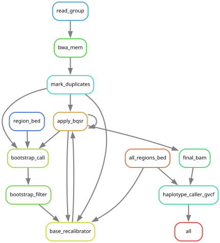
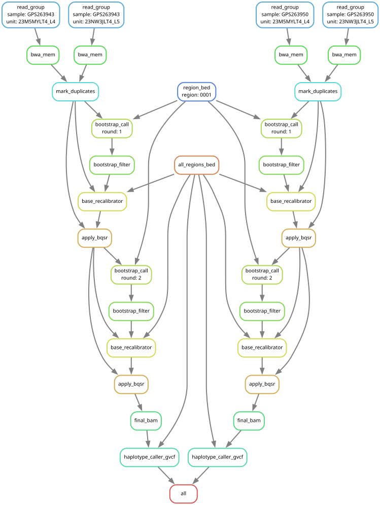

# fectdist_snakemake

Pool-seq pre-processing and calling, ported from `old/mappingAV_2023_Dec.sh`
(+ `bootstrapingAV` and `callingAV`).

```
per read group   bwa-mem2 mem | samtools sort
per pool         MarkDuplicates (merges the read groups)
                 bootstrap BQSR x rounds:
                     HaplotypeCaller per region -> hard filters -> known sites
                     -> BaseRecalibrator -> ApplyBQSR
                 HaplotypeCaller -ERC GVCF, ploidy from samples.tsv
```

Multi-lane / multi-library pools follow the GATK recommendation
([article](https://gatk.broadinstitute.org/hc/en-us/articles/360035889471)):
map per read group, MarkDuplicates on all read groups of a pool at once, BQSR
per pool (modelled per read group).

## Inputs

- `config/samples.tsv`: one row per pool: `sample`, `type`, `ploidy`
  - `type`: `drones` or `workers` (informative)
  - `ploidy`: HaplotypeCaller ploidy of the bootstrap calls and of the final
    gVCF.
    Drone pools: 2. The drones are brothers carrying only the queen's two
    copies, so the genotype called is the queen's.
    Worker pools: 50. The 2 x n_workers is impractical; the pool holds
    the queen (~25 % per copy) and up to ~25 fathers (~2 % each), and depth
    cannot resolve finer steps (an allele needs a few reads). Real ploidy is closer to 27 (2 queen + 25 drones) but we keep 50 as the frequencies are not equal between them.
- `config/units.tsv`: one row per read group (pool x library x lane):
  `sample`, `unit`, `fq1`, `fq2`, and optionally
  - `library` (default: the sample name, i.e. one library per pool)
- `config/config.yaml`: reference, targets, regions, BQSR parameters.
  The bwa-mem2 index, `.fai` and `.dict` of the reference must already exist.

To build both sheets from the provider's FASTQ names
(`{barcode}_{library}_{flowcell}_{lane}_{1|2}.fq.gz`), with the pool type taken
from the sample table (`CB ech ADN` -> `Type Matrice`):

```bash
tools/make_sheets.py --table ../Table_echantillons_FecDist.xlsm /path/to/fastq/*/*.fq.gz
# or: find /path/to/fastq -name "*.fq.gz" > files.txt; tools/make_sheets.py --table ... --list files.txt
```

Read groups are `ID={sample}.{unit} SM={sample} LB={library} PL=ILLUMINA`, with
`PU` parsed from the first read name of R1 (`{flowcell}.{lane}.{barcode}`). Only
Illumina (Casava >= 1.8) read names are accepted. Each unit must hold a single
lane; check with
`zcat R1.fastq.gz | awk 'NR%4==1' | cut -d: -f3,4 | sort | uniq -c` (one line).
Resulting read groups: `results/mapping/{sample}/{unit}.rg.txt`.

## Run

```bash
conda env create -f workflow/envs/snakemake.yaml
conda activate snakemake
snakemake -n                                          # dry run
snakemake --profile workflow/profiles/slurm_default   # on the cluster
snakemake --profile workflow/profiles/local           # locally, on small test data
```

## Outputs

| target (`targets` in config) | files |
|---|---|
| `bam`  | `results/bam/{sample}.bam` (recalibrated) |
| `gvcf` | `results/gvcf/{sample}.g.vcf.gz` |

Also kept: `results/qc/mark_duplicates/`, `results/bqsr/{sample}/round*.table`,
logs in `logs/{rule}/`.


## Graphs




Jobs of a local test (2 pools x 2 lanes, 1 chromosome, 2 BQSR rounds):



Regenerate :

```bash
snakemake --profile workflow/profiles/local --forceall --rulegraph | dot -Tsvg > docs/rulegraph.svg
snakemake --profile workflow/profiles/local --forceall --dag | dot -Tsvg > docs/dag_test.svg
```
